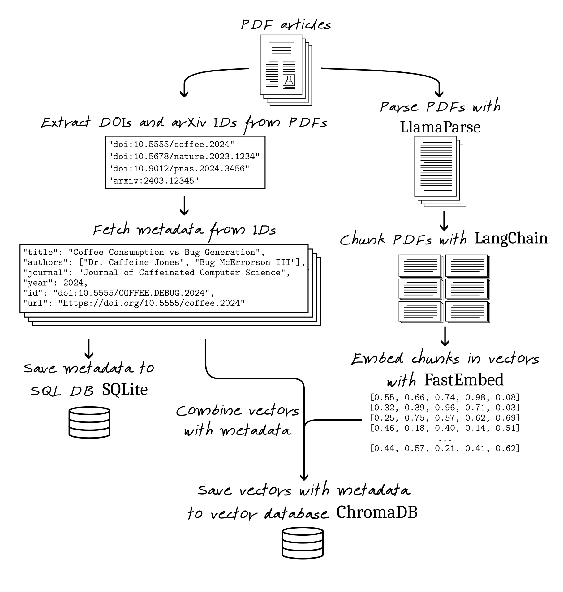
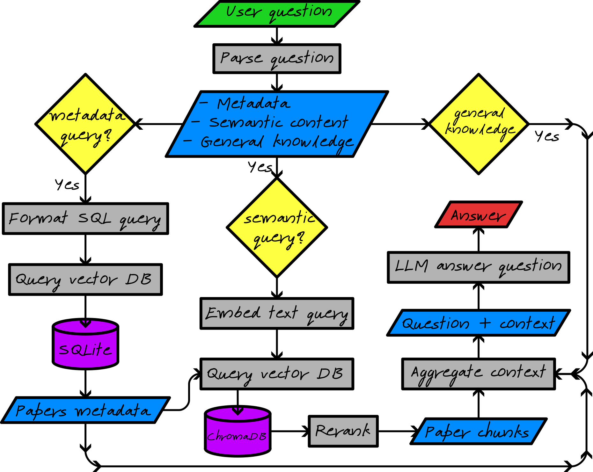

# GiantsMind: An Intelligent Research Assistant for Scientific Paper Management

As researchers, we've all experienced the frustration of trying to locate specific information in scientific papers we've read weeks or months ago, or summarize new papers to decide if we should read them. Whether it's recalling a neural network architecture, comparison metrics, or experimental details, finding precise information across multiple papers can be time-consuming and challenging. While Large Language Models (LLMs) like GPT-4 and Claude have made it easier to analyze individual papers, they weren't designed to handle libraries of papers with sophisticated filtering and search capabilities. This is where GiantsMind comes in.

## Architecture and Implementation

GiantsMind is built on a modern tech stack that combines the power of vector databases, SQLite relational databases, and state-of-the-art LLMs to create a paper querying tool. The architecture follows clean code principles and implements a modular design with clear separation of concerns.

At its core, GiantsMind uses a Retrieval Augmented Generation (RAG) pipeline that consists of several key components:

### Document Parsing

1. **Document Processing Pipeline**: Users drop PDF files into a folder, with a command GiantsMind extracts and processes them using the LlamaParse API. This component handles text extraction while preserving document structure and converts papers into a markdown format optimized for further processing.

2. **Metadata Management**: The system implements a sophisticated metadata extraction system that can identify paper details from both PDF metadata and content. It automatically detects and fetches metadata from DOIs and arXiv IDs, storing this information in a SQLite database with a well-structured schema that captures relationships between papers, authors, and journals.

3. **Vector Database Integration**: Document content is chunked and embedded using the FastEmbed embeddings model, then stored in a vector database (Qdrant/Chroma) for semantic search capabilities. This enables natural language queries across the paper collection.

### Question Answering

1. **Question Parsing and Understanding**: The project implements an intelligent question parsing system that breaks down user queries into three potential components:
   - Metadata searches (e.g., finding papers by specific authors or date ranges)
   - Content searches (semantic search through paper contents)
   - General knowledge queries (leveraging the LLM's knowledge)
  
2. **Metadata Retrieval**: If the parser identifies a metadata component, an LLM converts the natural language metadata request into a structured SQL query that executed against the SQLite database using custom database functions that support fuzzy matching for author names and other fields.

3. **Semantic Search and Reranking**: For content-related questions, GiantsMind converts the query into a vector representation and performs a similarity search in the vector database to find relevant text chunks that belong to papers filtered by the from with metadata retrieval. The Flashrank algorithm reranks the results, ensuring the most pertinent chunks are used to answer the question.

4. **Context Assembly and Response Generation**: The system then assembles a comprehensive context including the metadata of the filtered papers and the retreived chunks selected for the LLM to generate its response.

## Future Directions

While the current implementation focuses on question-answering capabilities, the modular architecture allows for easy extension to support additional features such as:

- Improve validation of LLM agents
- Improve the retrieval process using [contextual retrieval](https://www.anthropic.com/news/contextual-retrieval)
- Add an agent summarizing parts of or full articles

